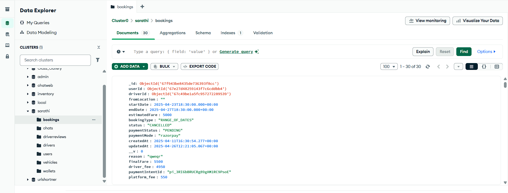
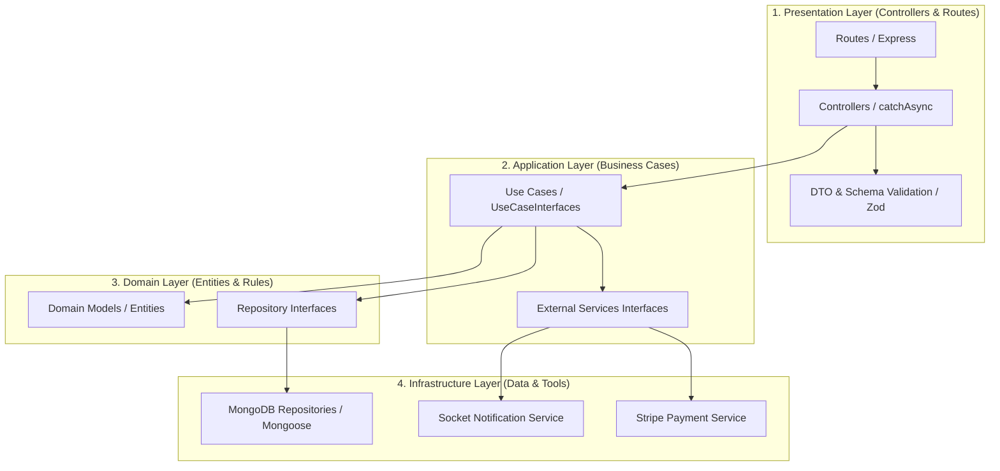
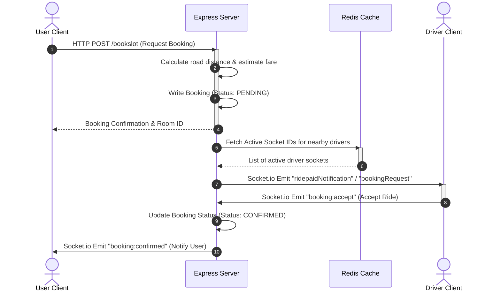

# Sarathi Backend (Driver-on-Demand Platform)

[](https://nodejs.org)
[](https://www.typescriptlang.org/)
[](https://expressjs.com/)
[](https://www.mongodb.com/)
[](https://redis.io/)
[](https://socket.io/)
[](https://webrtc.org/)
[](https://stripe.com/)

**Sarathi** (meaning *charioteer*) is a high-performance, real-time driver-on-demand platform. This repository contains the backend codebase—engineered using **TypeScript, Clean Architecture, and SOLID principles**. 

It handles automated driver matchmaking, WebRTC video calling & chat signaling, secure Stripe-split payment operations, and robust timezone-aware ride schedule management.

---

## 📸 Core Features in Action

* **Real-time Matchmaking & Broadcast:**
  
  
  *Example of a user booking request dynamically broadcasting to active drivers' screens in real-time.*

* **MongoDB Database Schema:**
  
  
  *MongoDB Atlas view showing the database collections and a sample booking document schema.*
---

## 🏗️ Architecture & Design Patterns

The backend is built following **Clean Architecture** boundaries and **Dependency Injection (DI)** using **Tsyringe** to decouple the layers and keep components isolated, testable, and maintainable.

### 1. Clean Architecture Layers



### 2. Real-Time Broadcast & Connection Flow

When a user requests a ride, the backend calculates distance telemetry and uses a Redis-backed Socket mapping system to locate active drivers:



---

## 🚀 Key Technical Highlights & Implementation Details

### ⚡ Redis-Backed Socket.io & Raw WebRTC Signaling
* **Redis State Storage:** To maintain seamless real-time connections, the server maps active socket connections to user and driver IDs using Redis (e.g. `driver:socket:<driverId>`).
* **Bi-directional WebRTC Handshake:** Handles SDP offer, answer, and ICE candidate distribution between user and driver namespaces safely resolving runtime ID representation discrepancies.

### 📅 Timezone-Aware Business Logic (IST Cutoff)
* To protect driver schedules, the platform restricts ride cancellations using a strict timezone-aware engine:
  * Cancellations are only permitted until **9:00 PM IST of the day prior** to the scheduled booking.
  * Employs UTC date shifts matched with UTC offset math (UTC+5:30) to guarantee consistency regardless of server runtime environment timezones.

### 💳 Stripe Split Payments
* Integrated **Stripe Connect Accounts** allowing drivers to register as connected merchants.
* Employs Stripe Payment Intents to authorize rides and automatically handles split fee distribution between the platform and the driver upon ride completion.

### 🗺️ Geotargeting & Location Telemetry
* Integrates Google Maps APIs (Autocomplete, Distance Matrix) to find nearest drivers and compute road travel metrics.
* Dynamic telemetry formatting converts raw float values to user-friendly UI readings (meters, rounded kilometers, or `"Nearby"` indicator labels).

---

## 📂 Directory Structure

```directory
sarathi-backend/
├── src/
│   ├── application/            # Business Logic & Use Cases
│   │   ├── dto/                # Data Transfer Objects (Validation types)
│   │   ├── services/           # Service Interfaces (Mail, Stripe, Sockets)
│   │   └── use_cases/          # Independent Use Case Implementations
│   ├── domain/                 # Core Entities & Interfaces
│   │   ├── errors/             # Domain Error Abstractions
│   │   ├── models/             # Domain Model Blueprints
│   │   └── repositories/       # Core Repository Interfaces
│   ├── infrastructure/         # Frameworks, Database, Sockets & APIs
│   │   ├── config/             # DI Containers (Tsyringe) & Config
│   │   ├── database/           # Mongoose Models & MongoDB Repositories
│   │   ├── services/           # Concrete Service Implementations
│   │   └── socket/             # Socket.IO Listeners & Redis Mappings
│   ├── presentation/           # HTTP Routing & Controller Layer
│   │   ├── controllers/        # catchAsync Express Controllers
│   │   ├── routes/             # Express Router Declarations
│   │   └── schemas/            # Zod validation schemas
│   └── index.ts                # Application Bootstrap File
```

---

## 🛠️ Getting Started

### Prerequisites
* **Node.js** (v18+)
* **MongoDB** (Local instance or MongoDB Atlas URL)
* **Redis Server** (Active on local/remote port)

### 1. Installation
Clone the repository and install dependencies:
```bash
npm install
```

### 2. Environment Setup
Create a `.env` file in the root folder using this schema:
```env
# Application Server Config
PORT=3000
NODE_ENV=development

# Database Configuration
MONGO_URI=mongodb://localhost:27017/sarathi

# Cache Server Configuration
REDIS_HOST=127.0.0.1
REDIS_PORT=6379

# JWT Secrets
JWT_SECRET=your_jwt_access_secret_key
JWT_REFRESH_SECRET=your_jwt_refresh_secret_key

# Third-Party Integrations
STRIPE_SECRET_KEY=your_stripe_secret_key
CLOUDINARY_CLOUD_NAME=your_cloudinary_name
CLOUDINARY_API_KEY=your_api_key
CLOUDINARY_API_SECRET=your_api_secret

# Geolocation API
GOOGLE_MAPS_API_KEY=your_google_maps_key
```

### 3. Running Locally
Run the development server with live reload:
```bash
npm run dev
```

Run compilation build:
```bash
npm run build
```

---

## 🌐 Production Infrastructure & Deployment

The production environment is hosted on a secure **AWS EC2** instance, utilizing a reverse proxy and daemon process management:
* **NGINX:** Serves as the primary reverse proxy handling SSL certificates, cookie security settings (for secure cross-site Google Auth session management), and rate-limiting.
* **PM2:** Manages the application lifecycle, supporting clustering and automatic recovery on runtime failures.